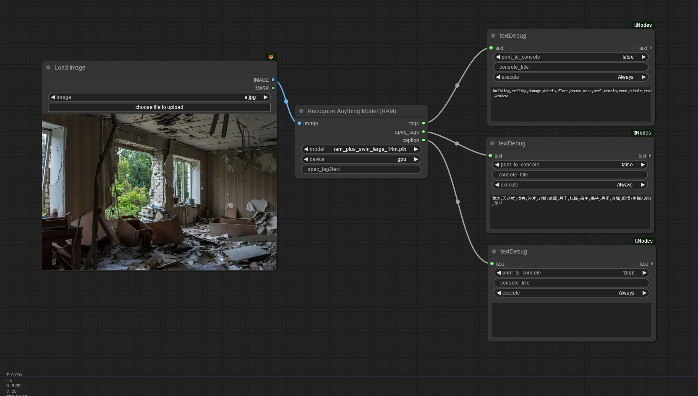
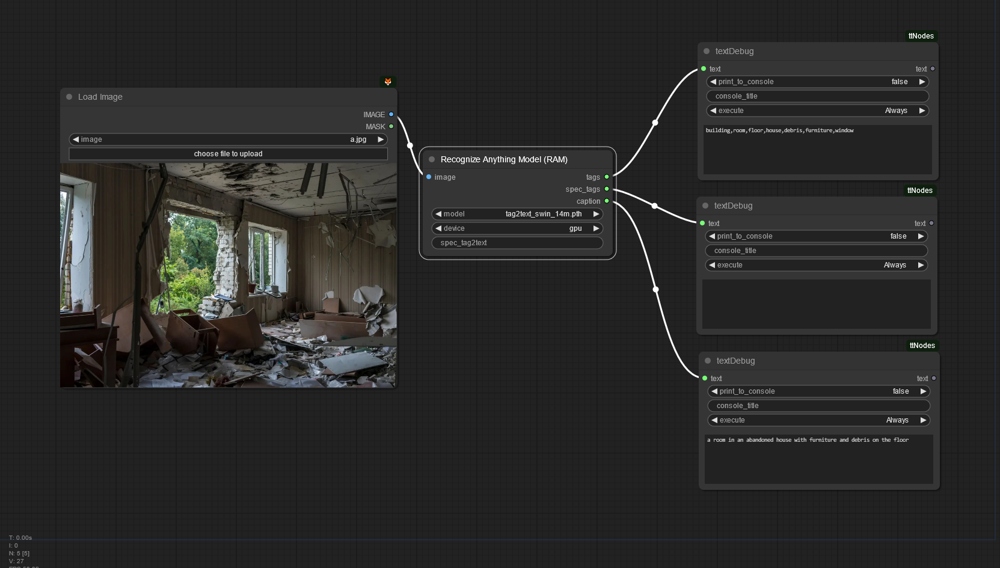

# Recognize Anything Model (RAM++) for ComfyUI

## Image Tagging and Captioning

The counterpart to Segment Anything Model (SAM)

This is an image recognition node for [ComfyUI](https://github.com/comfyanonymous/ComfyUI) based on the RAM++ model from [xinyu1205](https://huggingface.co/xinyu1205).

* https://huggingface.co/xinyu1205/recognize-anything-plus-model
* https://github.com/xinyu1205/recognize-anything
* This node outputs a string of tags with all the recognized objects and elements in the image
* 3 different models.
* RAM and RAM++ outputs tags in English and Chinese language:
  
* tag2text outputs image tags and an image caption at the same time. It also takes user specified tags to be considered in the output:
  

## Installation

Git clone this repository inside the *custom_nodes* folder or use ComfyUI-Manager and search for "RAM".

ℹ️ In order to make this node work, the "ram" package need to be installed. To do so, open a terminal inside the *python_embedded* folder within your ComfyUI installation:

```
python.exe -m pip install git+https://github.com/Hangover3832/recognize-anything.git
```

Furthermore you need to download the [RAM](https://huggingface.co/xinyu1205/recognize_anything_model/resolve/main/ram_swin_large_14m.pth),
[RAM++](https://huggingface.co/xinyu1205/recognize-anything-plus-model/resolve/main/ram_plus_swin_large_14m.pth) and [tag2text](https://huggingface.co/xinyu1205/recognize_anything_model/resolve/main/tag2text_swin_14m.pth) models and place it in the /ComfyUI/models/rams/ folder or use the [ComfyUI-Manager](https://github.com/ltdrdata/ComfyUI-Manager) model downloader. You can also configure the location in 'extra_model_paths.yaml' in the Confyui folder.

## Updates

* Added RAM and tag2text models.
* Support for the 'extra_model_paths.yaml' configuration.

## To Do
