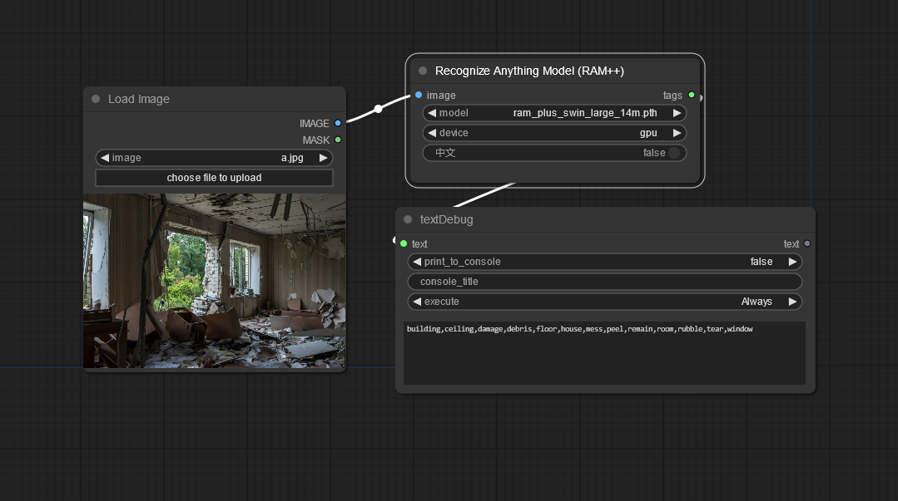

# Recognize Anything Model (RAM++) for ComfyUI

The counterpart to Segment Anything Model (SAM)

This is an image recognition node for [ComfyUI](https://github.com/comfyanonymous/ComfyUI) based on the RAM++ model from [xinyu1205](https://huggingface.co/xinyu1205).

* https://huggingface.co/xinyu1205/recognize-anything-plus-model
* https://github.com/xinyu1205/recognize-anything


This node outputs a string of tags with all the recognized objects and elements in the image in English or Chinese language.

## Installation

Git clone this repository inside the *custom_nodes* folder.

ℹ️ In order to make this node work, the "ram" package need to be installed. To do so, open a terminal inside the *python_embedded* folder within your ComfyUI installation:

```
python.exe -m pip install git+https://github.com/Hangover3832/recognize-anything.git
```

~~or within the ComfyUI-Manager => "Install PIP packages" and type in git+https://github.com/Hangover3832/recognize-anything.git~~ (seems actually not working)

Furthermore you need to download the [RAM++ model](https://huggingface.co/xinyu1205/recognize-anything-plus-model/resolve/main/ram_plus_swin_large_14m.pth) and place it in the \ComfyUI\models\rams\ folder or use ComfyUI-Manger model downloader.

## Updates

## To Do
